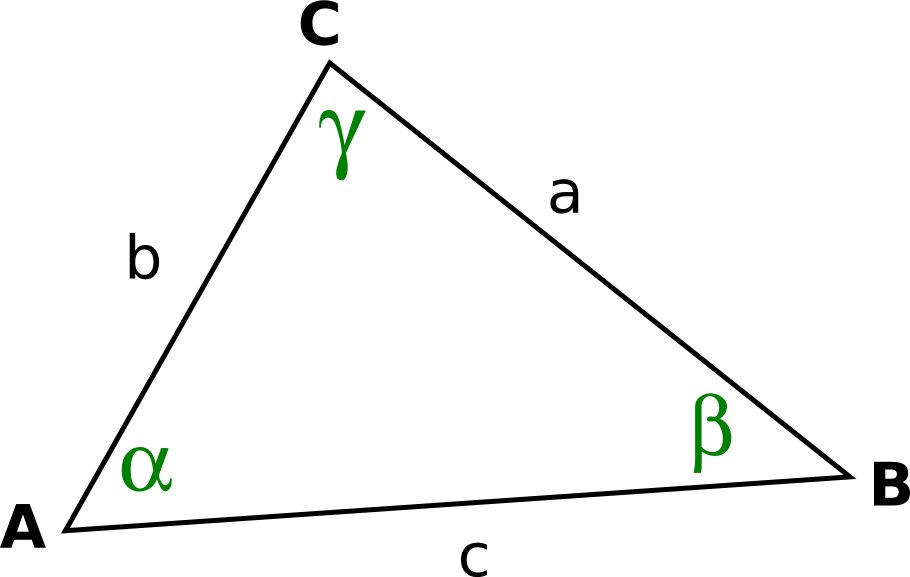

# Dreiecke berechnen
Eine umfassende Übersicht über verschiedene Arten, alle Größen aus einem Dreieck zu berechnen.

Um ein Dreieck genau bestimmen zu können, müssen drei Daten darüber gegeben sein, also zum Beispiel zwei Seiten und ein Winkel (SWS) oder zwei Winkel und eine Seite. Vorgehensweise:

## SWS (Seite-Winkel-Seite)

### Normalfall

Seitenlängen **a** und **b**, sowie der Winkel dazwischen, genannt **&gamma;**, seien bekannt.

1. Berechne die **Seitenlänge c** über den **Kosinussatz**.
2. Berechne den **Winkel &beta;** über den **Kosinussatz**.
3. Berechne den  **dritten Winkel, &alpha;**, daraus, dass die Summe 180° beträgt.
4. Höhe und Flächeninhalt berechnen.

### Sonderfall

Zwei Seiten **a, b,** sowie ein anderer Winkel, **&alpha;**, seien bekannt.

1. Berechne den **Winkel &beta;** über den **Sinussatz**.  
Berücksichtige hierbei Angaben aus der Aufgabenstellung, ob es sich um ein spitzwinkliges Dreieck handelt. Der Sinussatz kann wegen <em>sin(&beta;) = sin(180° - &beta;)</em> zwei Lösungen liefern.
2. Berechne den **dritten Winkel, &gamma;**, daraus, dass die Summe der drei Winkel 180° beträgt.
3. Berechne die **Seitenlänge c** über den **Sinussatz**.
4. Höhe und Flächeninhalt berechnen.

## WSW

### Normalfall

Eine Seitenlänge **b**, sowie die angrenzenden Winkel **&alpha;, &gamma;** seien bekannt.

1. Berechne den **dritten Winkel &beta;** daraus, dass die Summe der drei Winkel 180° beträgt.
2. Berechne die **Seitenlänge c** über den **Sinussatz**.
3. Berechne die **Seitenlänge a** über den **Sinussatz**.
4. Höhe und Flächeninhalt berechnen.

### Sonderfall

Eine Seitenlänge **a**, der gegenüberliegende Winkel **&alpha;** und ein weiterer Winkel **&gamma;** seien bekannt.

1. Berechne den **dritten Winkel &beta;** daraus, dass die Summe der drei Winkel 180° beträgt.
2. Berechne die **Seitenlänge c** über den **Sinussatz**.
3. Berechne die **Seitenlänge b** über den **Sinussatz**.
4. Höhe und Flächeninhalt berechnen.
